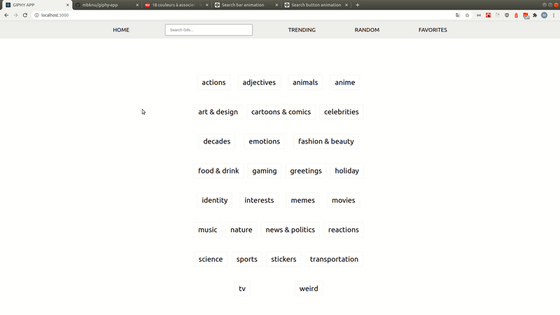
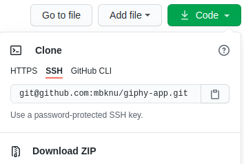
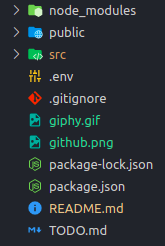

# Getting Started with Create React App

This project was bootstrapped with [Create React App](https://github.com/facebook/create-react-app).

## Purpose of the Project

This Project was created to improve my coding experience with an API.

My mains objectives were :\
-Anytime you do a search you can see the results\
-You can chose by categories\
-You can add gif to favorites or remove\
-You can select a random gif or a random gif in a specific categorie\

## Available Scripts

In the project directory, you can run:

### `npm start`

Runs the app in the development mode.\
Open [http://localhost:3000](http://localhost:3000) to view it in the browser.

The page will reload if you make edits.\
You will also see any lint errors in the console.

### `npm test`

Launches the test runner in the interactive watch mode.\
See the section about [running tests](https://facebook.github.io/create-react-app/docs/running-tests) for more information.

### `npm run build`

Builds the app for production to the `build` folder.\
It correctly bundles React in production mode and optimizes the build for the best performance.

The build is minified and the filenames include the hashes.\
Your app is ready to be deployed!

See the section about [deployment](https://facebook.github.io/create-react-app/docs/deployment) for more information.

### `npm run eject`

**Note: this is a one-way operation. Once you `eject`, you can’t go back!**

If you aren’t satisfied with the build tool and configuration choices, you can `eject` at any time. This command will remove the single build dependency from your project.

Instead, it will copy all the configuration files and the transitive dependencies (webpack, Babel, ESLint, etc) right into your project so you have full control over them. All of the commands except `eject` will still work, but they will point to the copied scripts so you can tweak them. At this point you’re on your own.

You don’t have to ever use `eject`. The curated feature set is suitable for small and middle deployments, and you shouldn’t feel obligated to use this feature. However we understand that this tool wouldn’t be useful if you couldn’t customize it when you are ready for it.

## Learn More

You can learn more in the [Create React App documentation](https://facebook.github.io/create-react-app/docs/getting-started).

To learn React, check out the [React documentation](https://reactjs.org/).

## How to launch the Project

### Install

First of all you need to clone the repostory to a local folder\

Then you have to install the dependencies by typing in your terminal : npm i --save\

You will need a key to get access to the API from [GIPHY](https://giphy.com/)

Once you have the key juste create a new file ".env" in the root of the project, you should have this :\

Open the .env file and add your key after : REACT_APP_API_KEY=\
You should have something like : REACT_APP_API_KEY="540a5zea4e55a4e".\

### Run

Everything is good now just run the project by typing in your terminal : npm start
